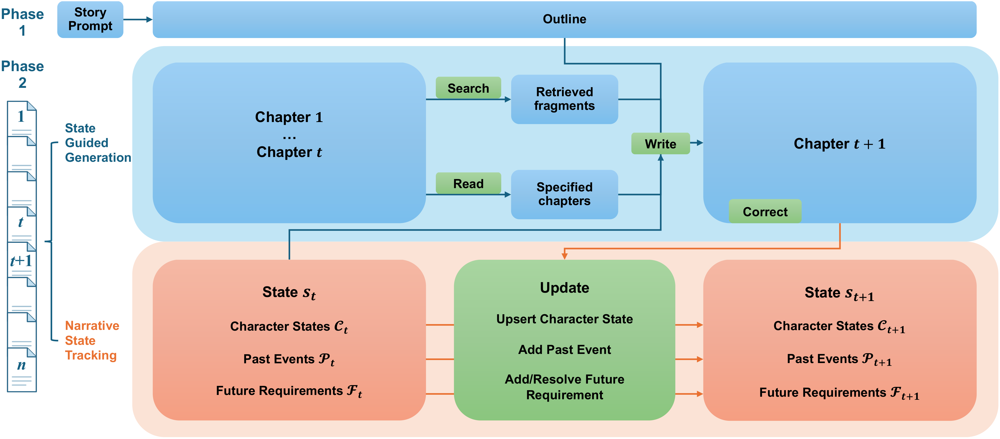

# NstAgent

<p align="center">
  <a href="https://github.com/zhennan1/NstAgent">🌐 Github</a> |
  <a href="https://arxiv.org/abs/2609.35759">📖 Paper</a> |
  <a href="https://huggingface.co/datasets/zhennan1/NstAgent">🤗 Data</a>
</p>

## Introduction

NstAgent (Narrative State Tracking Agent) is a training-free agentic framework for scaling long-form story generation toward full-length novels.



Overview of NstAgent: The framework first plans a frozen outline from the story prompt, and then writes the story chapter by chapter. In state-guided generation, the model writes chapter t+1 from the outline and state t, optionally searching or reading earlier chapters and correcting errors. In narrative state tracking, the update call turns state t into state t+1, which records characters, past events and future requirements.

## Setup

```bash
git clone https://github.com/zhennan1/NstAgent.git
cd NstAgent
```

```bash
conda create -n nstagent python=3.11 -y
conda activate nstagent
pip install -r requirements.txt
```

## Data

`data/` contains the 100 English prompts from [ConStory-Bench](https://github.com/Picrew/ConStory-Bench) and the WritingBench criteria used for evaluation. `results/` contains the judge outputs and the tables and figures of the paper.

The generated stories (2,030 stories, about 800 MB) are on [Hugging Face](https://huggingface.co/datasets/zhennan1/NstAgent):

```bash
huggingface-cli download zhennan1/NstAgent --repo-type dataset --local-dir . --include "results/stories/*"
```

The results should be organized as follows:

```bash
./
└── results/
    ├── arms.json          # evaluated arms and story counts
    ├── stories/           # generated stories, <backbone>/<method>_<length>.jsonl
    ├── scores/            # ConStory-Bench and WritingBench judge outputs
    ├── usage/             # per-call API usage for the cost table
    ├── case_study/        # data for the case studies
    ├── rl/                # outputs of the RL study
    ├── tables/
    └── figures/
```

Each story line contains the prompt, the outline, the chapters, and for NstAgent the final narrative state and the tool trace of every chapter.

## Usage

### Generation

All scripts use an OpenAI-compatible API and read the key from `OPENAI_API_KEY`. `WORDS` is the target length (10000, 20000, 50000 or 100000).

First, build the frozen outlines shared by NstAgent and RollSum:

```bash
python code/generation/build_outline_cache.py --input data/prompts_en.jsonl --cache-dir outline_cache \
  --manifest outline_cache/manifest.json --model $MODEL --cache-model-id $MODEL --api-base $API_BASE \
  --word-count $WORDS --max-tokens 32768 --temperature 0.7 --policy read-write
```

Run NstAgent:

```bash
python code/agent/nstagent.py --input data/prompts_en.jsonl --output nstagent.jsonl \
  --model $MODEL --api-base $API_BASE --word-count $WORDS --max-tokens 32768 --temperature 0.7 \
  --chapter-token-control dynamic --dynamic-token-overhead 1536 \
  --length-control-mode adaptive_recent_failure --max-turns-per-chapter 50 \
  --request-attempts 3 --client-max-retries 2 --auto-resumes 3 \
  --outline-cache-dir outline_cache --outline-cache-policy require --outline-cache-model-id $MODEL
```

`code/agent/ablations.py` takes the same arguments plus `--ablation no_state|no_lookback`.

Run RollSum:

```bash
python code/baselines/rolling_summary.py --input data/prompts_en.jsonl --output rollsum.jsonl \
  --model $MODEL --api-base $API_BASE --word-count $WORDS --max-tokens 32768 \
  --outline-max-tokens 32768 --summary-max-tokens 16384 --temperature 0.7 --client-max-retries 2 \
  --request-timeout 1200 --submission-mode plain --token-control dynamic \
  --dynamic-token-overhead 1536 --chapter-target-ratio-en 1.0 \
  --length-control-mode adaptive_recent_failure --max-length-attempts 50 --auto-resumes 3 \
  --outline-cache-dir outline_cache --outline-cache-policy require --outline-cache-model-id $MODEL
```

Direct is in `code/baselines/direct.py`. DOME and StoryWriter run from their released code:

```bash
cd code/baselines
git clone https://github.com/Qianyue-Wang1/NAACL-25-DOME-story-generation \
  Generating-Long-form-Story-Using-Dynamic-Hierarchical-Outlining-with-Memory-Enhancement
git clone https://github.com/THU-KEG/StoryWriter
perl -pi -e 's/sk-[A-Za-z0-9]{48}/REDACTED_API_KEY/g' StoryWriter/agent_try.py
patch -p1 -d StoryWriter < upstream/storywriter_agent_try.patch
```

DOME also needs a Neo4j 5 server and `sentence-transformers/all-MiniLM-L6-v2`; StoryWriter needs `pyautogen==0.2.35`.

### Evaluation

We evaluate narrative consistency with an extended [ConStory-Bench](https://github.com/Picrew/ConStory-Bench) and writing quality with [WritingBench](https://github.com/X-PLUG/WritingBench). `N` is the number of final chapters checked: 999 at 10K (all chapters), and 7, 5, 4 at 20K, 50K, 100K.

```bash
python code/evaluation/prepare_final_evaluation.py --dataset nstagent_10k=nstagent.jsonl \
  --output-dir validated --expected-samples 100 --expected-prompts data/prompts_en.jsonl \
  --reject-duplicates --allow-whole-story-out-of-range

python code/evaluation/constory/evaluate.py --input validated/nstagent_10k.jsonl --output constory.csv \
  --judge-model DeepSeek-V4-Pro --api-base $API_BASE --max-tokens 65536 --request-timeout 3600 \
  --target-ending-chapters N

python code/evaluation/writingbench/prepare_writingbench_input.py --input validated/nstagent_10k.jsonl \
  --output wb_input.jsonl
python code/evaluation/writingbench/evaluate.py --input wb_input.jsonl --output writingbench.jsonl \
  --criteria-cache data/writingbench_criteria_cache.jsonl --judge-model DeepSeek-V4-Pro \
  --api-base $API_BASE --max-tokens 65536 --request-timeout 3600
```

## Citation

If you find this project helpful, please cite it as follows:

```bibtex
@article{wan2026nstagent,
  title={Scaling Long-Form Story Generation via Narrative State Tracking},
  author={Zhennan Wan and Jianfei Chen},
  year={2026}
}
```
